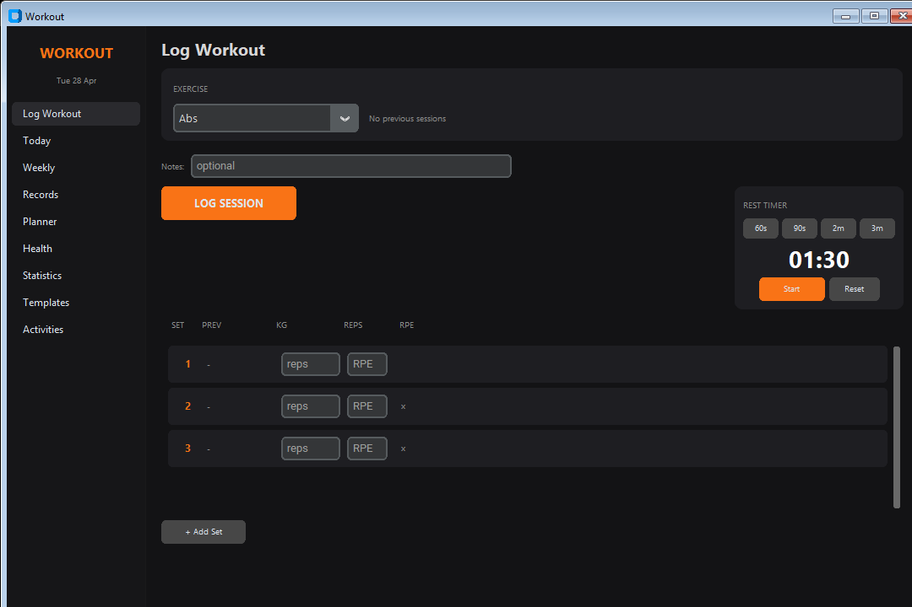
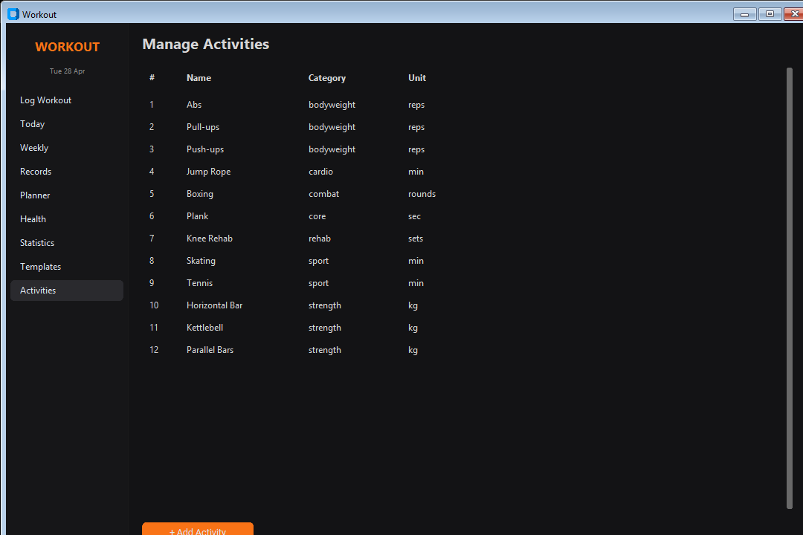

# Workout Tracker

A personal workout tracking desktop app built with Python and CustomTkinter. Tracks sets, reps, weight, duration, personal records, weekly plans, health metrics, and more — all stored locally with no account required.

## Download

[](https://raw.githubusercontent.com/lefteriskrith/Workout/main/releases/Workout.zip)

> **Windows only** · No installation required · Just unzip and run `Workout.exe`  
> Your data is saved in `%USERPROFILE%\.workout_tracker\workout.db`

---

## Screenshots

| Log Workout | Manage Activities |
|:-----------:|:-----------------:|
|  |  |

---

## Features

### Log Workout
Log each set individually with weight (kg), reps, duration, and RPE (Rate of Perceived Exertion). The app shows your previous session's numbers as a reference, calculates an estimated 1-Rep Max live as you type, and flags any new personal records the moment you log them.

### Today
A summary of everything you logged today — exercises done, max weight, max reps, total duration, and average RPE per exercise. Also shows the day's health snapshot (weight, sleep, energy) if logged.

### Weekly Overview
See each day of the current week as a card with planned vs completed exercises. A progress bar and ratio (e.g. `3/5`) shows how much of the day's plan is done. Unplanned extras are shown with a `+` marker.

### Personal Records
A table of lifetime bests per exercise — best weight, best reps, best duration, best volume, and the date it was set. Updated automatically every time you log a session.

### Weekly Planner
Set target sets, reps, weight, and duration per exercise per day of the week. Copy last week's plan with one click to avoid re-entering the same routine every Monday.

### Health Log
Log daily body weight, sleep hours, energy level (1–10), and pain/discomfort notes. The last 30 days are shown in a table with colour-coded energy levels.

### Statistics
- **Frequency (30 days):** how many times you did each exercise, total sets, reps, and minutes
- **Weekly Trend:** sessions, active days, and different exercises per week for the last 8 weeks, with a visual volume bar

### Templates
Save reusable workout routines (e.g. "Push Day", "Leg Day") with a list of exercises and target sets/reps/weight. Use them as a quick reference when planning or logging.

### Activities
Add your own custom exercises with a name, category (sport / strength / bodyweight / cardio / combat / core / rehab), and unit (reps / kg / min / sec / rounds / sets).

### Rest Timer
Built into the Log Workout page — preset buttons for 60s, 90s, 2m, 3m. Beeps three times when it reaches zero.

---

## Default Activities

| Exercise | Category | Unit |
|---|---|---|
| Abs | bodyweight | reps |
| Pull-ups | bodyweight | reps |
| Push-ups | bodyweight | reps |
| Jump Rope | cardio | min |
| Boxing | combat | rounds |
| Plank | core | sec |
| Knee Rehab | rehab | sets |
| Skating | sport | min |
| Tennis | sport | min |
| Horizontal Bar | strength | kg |
| Kettlebell | strength | kg |
| Parallel Bars | strength | kg |

---

## Running from Source

**Requirements:** Python 3.10+

```bash
pip install -r requirements.txt
python WorkoutApp.py
```

There is also a terminal (CLI) interface using [Rich](https://github.com/Textualize/rich):

```bash
python main.py
```

---

## Running Tests

47 smoke and regression tests covering all modules:

```bash
python -m pytest tests/ -v
```

---

## Project Structure

```
Workout/
├── workout/              # Business logic package
│   ├── db.py             # Database connection, schema, migrations
│   ├── activities.py     # Exercise library (CRUD)
│   ├── workouts.py       # Logging, PR detection, session queries
│   ├── stats.py          # Streak, frequency, weekly volume
│   ├── health.py         # Daily health log
│   ├── planner.py        # Weekly planner
│   └── templates.py      # Workout templates
├── WorkoutApp.py         # GUI entry point (CustomTkinter)
├── main.py               # CLI entry point (Rich)
├── releases/
│   └── Workout.zip       # Pre-built Windows executable
└── tests/
    └── test_workout.py   # 47 smoke + regression tests
```
